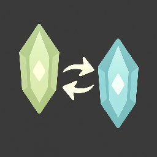
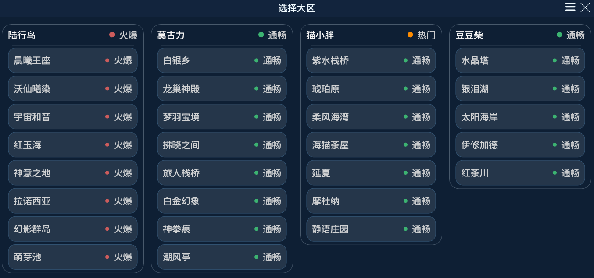
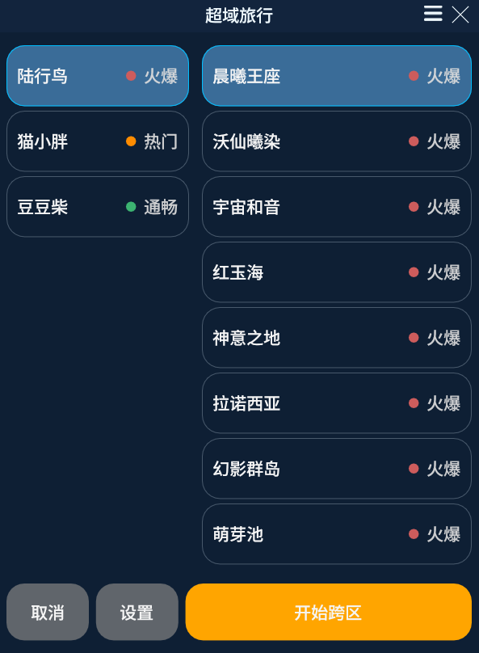
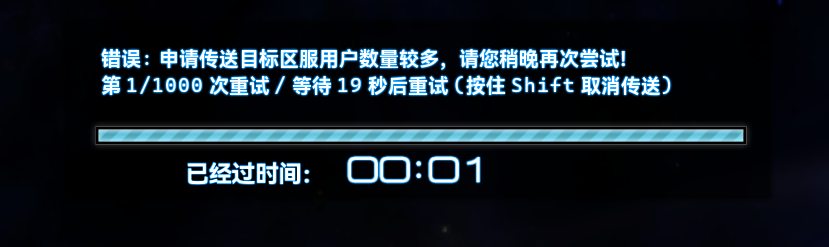

  <h1>DCTravelerX</h1>
  <h5>最终幻想 XIV 国服游戏内跨大区插件</h5>
  

  
  
  
  

## 功能特色

### 游戏标题界面一键选择登录大区

  

### 角色选择界面一键跨大区

  

### 支持反复重试, 并智能分流至当前大区内其他空闲服务器

  

## 下载使用

1. 前往 [插件库发布页面](https://github.com/AtmoOmen/DalamudPlugins) 获取仓库链接
2. 打开 **Dalamud 设置 - 插件 - 第三方插件** 页面, 填入仓库链接后, 点击设置页最上方的保存按钮
3. 打开 **Dalamud 插件** 页面, 搜索并下载安装 `DCTravelerX` 插件

> [!NOTE]
> 本插件需要配套 [XIVLauncherCN (Soil)](https://github.com/AtmoOmen/FFXIVQuickLauncher/) 登录使用, 且不支持 WeGame 登录渠道

## 免责声明

- 本项目为第三方工具, 与 `SQUARE ENIX`、`盛趣游戏` 均无附属关系。
- 使用任何第三方工具都可能伴随潜在风险, 请自行评估并承担后果。
- 项目以社区维护为主, 不承诺对所有环境、所有外部服务异常都提供即时支持。

---

  Final Fantasy XIV © SQUARE ENIX CO., LTD. / 盛趣游戏。 本项目仅为社区维护的第三方工具

